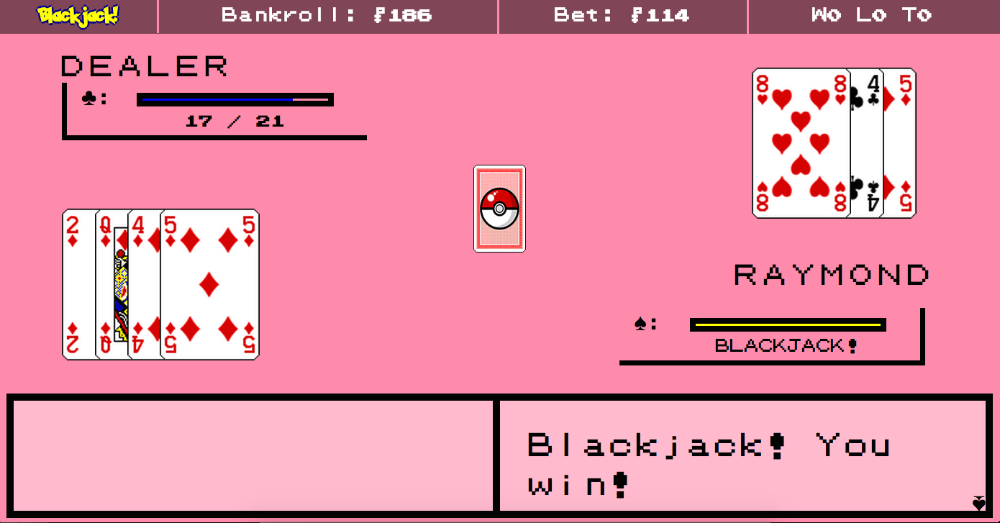

## Blackjack

A single-player Blackjack game, designed with nostalgia.

---

### Screenshots

---

### User Story

- As a user, I would like financial freedom in terms of selecting my bankroll and placing and resetting my bets.
  - The top navigation bar is essential for identifying how much I have in my bankroll and the current bet at any given time.
  - The bankroll can only be changed before the first hand is dealt!
- As a user, I would like to draw cards and have autonomy over my actions afterwards.
- As a user, clarity about my hand is extremely important.
  - The bar under my name should display the point value of my hand, and be understood instantly. It should be prefaced by a Diamond if my hand is under 10 points, a Club if my hand is between 10 and 20 points, a Heart if I bust, and a Spade if I land a Blackjack, with accompanying colors as well.
  - Mousing over each card should display its name and point value for me to manually consider the information laid on the table.
- As a user, I would like to know my win/loss record at a glance to the top right.
- As a user, I would like to be able to form a personal relationship with each game by specifying my name (hint: this can only be done before the first turn).

---
### Test Statements

- In the event that I try to begin a game with a bet under $5, over $100, or greater than my current bankroll, I should receive an error message.
- "Hit" should draw a single card.
  - If my hand remains under 21 points, I should be able to select another action.
  - If my hand reaches exactly 21 points, the rest of the game will be automated for the dealer to act according to his own logic.
  - If my hand exceeds 21 points, I should be informed of my loss.
  - If my hand ties with the dealer's, a "push" will occur, during which my bet is refunded and the game is ended.
- "Stand" should compare my hand to the dealer's. No more actions can be taken after this point.
- "Down", or "Double Down", should double my bet, draw exactly one card, and stand. No more actions can be taken after this point.
- "Fold", or "Surrender", should only be available on the first turn (before any other actions have been taken in that round). A surrender is an automatic loss, but half of the bet is returned.

---
### TO DO:
- Maybe a tutorial to show that name and bankroll can be set
- Fix hover card name and value positions!
- Could add some responsiveness for screen height
- ~~Make Blackjack bars fill up in intervals~~
  - Did this, but need to update point values to do this also--setInterval probably
- Decide on a decent mouseover animation for Deal button that isn't tacky
- Insurance?
